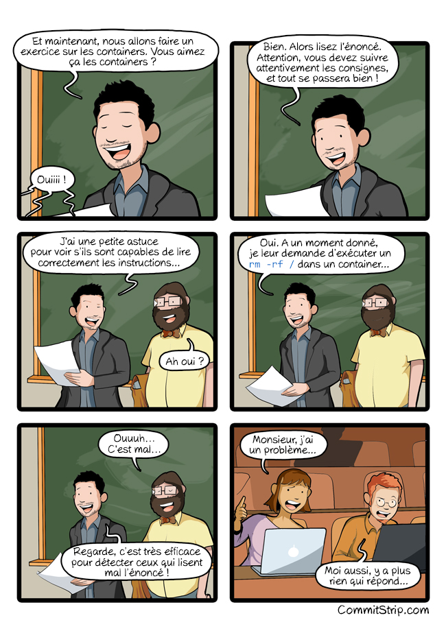

# POO ou la programmation orientée objet

## Cours

- [Introduction à la POO](https://docs.google.com/presentation/d/15NaUU7pfCL1pHCjdT-iqiAqgFjt_FRUN3RSCQG1EodE/edit?usp=sharing)
- [POO - chapitre 2](https://docs.google.com/presentation/d/13TD29INIBJy9YFh6VDORqE_sJamQ50ltoJWvINsicWk/edit?usp=sharing)

## Exercice 1 : Helpers Class

* `POO` [Étape 1](POO-Helpers-Class-etape-1.md)
* `POO` [Étape 2](POO-Helpers-Class-etape-2.md)
* `POO` [Étape 3](POO-Helpers-Class-etape-3.md)

## Exercice 2

* `POO` [Parc de voitures](POO-ParcDeVoitures.md)

## Exercice 3

Crée une `class DataBase` qui a une méthode pour se connecter à une base de donnée
Crée une `class User` qui a les propriétés suivantes

- id
- username
- email
- password
- connected

qui permet de :

- Enregistrer un nouvel utilisateur dans la base de donnée avec validation
- De connecter un utilisateur (sessions)
- De déconnecter un utilisateur (sessions)
- De mettre à jour son nom dans la base de donnée
- De mettre à jour son email dans la base de donnée
- De le supprimer de la base de donnée

## Ressources

- [Manuel PHP](https://www.php.net/manual/en/language.oop5.php)
- [POO W3C](https://www.w3schools.com/php/php_oop_classes_objects.asp)
- [Introduction à la POO](https://openclassrooms.com/courses/programmez-en-oriente-objet-en-php/introduction-a-la-poo)
- [Autoloading](https://www.grafikart.fr/formations/programmation-objet-php/autoload)

